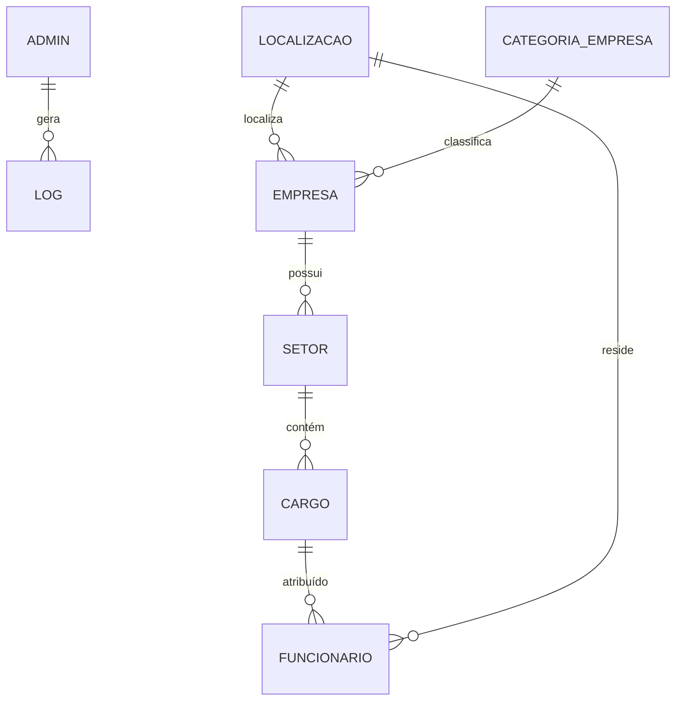

# 🧩 Banco de Dados Corporativo — Documentação Técnica
### (Normalização, Índices e Otimização)

---

## 1️⃣ Tabelas Originais

As tabelas originais refletem a estrutura inicial do banco de dados antes de normalizações e otimizações:

- `admin` — armazenando administradores do sistema.
- `log` — registrando operações (INSERT, UPDATE, DELETE).
- `dau` — registro de acesso diário dos usuários.
- `localizacao` — estados e cidades para empresas e funcionários.
- `categoria_empresa` — classificação das empresas.
- `empresa` — informações das empresas (CNPJ, nome, categoria, localização).
- `setor` — setores internos de cada empresa.
- `cargo` — cargos dentro de setores, com nível hierárquico.
- `funcionario` — funcionários com referência a cargo e localização.

---

## 2️⃣ Tabelas Normalizadas

O banco segue **Terceira Forma Normal (3FN)**:

- Cada coluna contém valores atômicos (1FN).
- Todas as colunas dependem completamente da chave primária (2FN).
- Não há dependências de colunas não-chave (3FN).

Exemplos de normalização:

- `funcionario` referencia `cargo` e `localizacao` via FK.  
- `cargo` referencia `setor`, que referencia `empresa`, evitando duplicidade de dados.  
- `empresa` separa `localizacao` e `categoria_empresa` em tabelas próprias.

---

## 3️⃣ Relacionamentos



Relações principais:

| Relação | Tipo | Descrição |
|----------|------|-----------|
| `empresa` → `localizacao` | 1:N | Uma localização pode ter várias empresas |
| `empresa` → `categoria_empresa` | 1:N | Cada empresa pertence a uma categoria |
| `setor` → `empresa` | 1:N | Cada setor pertence a uma empresa |
| `cargo` → `setor` | 1:N | Cada cargo pertence a um setor |
| `funcionario` → `cargo` | 1:N | Cada funcionário tem um cargo |
| `funcionario` → `localizacao` | 1:N | Cada funcionário está em uma localização |

---

## 4️⃣ Tabela de Dados (Campos Principais)

### Funcionario

| Campo | Tipo | Descrição |
|-------|------|-----------|
| numero_cracha | BIGINT (PK) | Identificador único |
| nome | VARCHAR(255) | Nome do funcionário |
| sobrenome | VARCHAR(255) | Sobrenome |
| email | VARCHAR(255) | E-mail corporativo |
| senha | VARCHAR(255) | Senha criptografada |
| id_cargo | INT (FK) | Cargo do funcionário |
| id_localizacao | INT (FK) | Localização do funcionário |
| is_gestor | BOOLEAN | Se é gestor |
| primeiro_acesso | BOOLEAN | Indica primeiro login |

### Empresa

| Campo | Tipo | Descrição |
|-------|------|-----------|
| id | SERIAL (PK) | Identificador |
| cnpj | CHAR(14) | CNPJ único |
| nome | VARCHAR(255) | Nome da empresa |
| id_localizacao | INT (FK) | Localização |
| id_categoria | INT (FK) | Categoria da empresa |
| senha | VARCHAR(255) | Senha de acesso |

Outras tabelas seguem mesma lógica: `setor`, `cargo`, `categoria_empresa`, `localizacao`, `admin`, `log`, `dau`.

---

## 5️⃣ Métodos de Otimização

### Índices Criados

```sql
CREATE INDEX idx_funcionario_cargo ON funcionario(id_cargo);
CREATE INDEX idx_funcionario_localizacao ON funcionario(id_localizacao);
CREATE INDEX idx_funcionario_isgestor ON funcionario(is_gestor);
CREATE INDEX idx_empresa_categoria ON empresa(id_categoria);
CREATE INDEX idx_empresa_localizacao ON empresa(id_localizacao);
CREATE INDEX idx_empresa_nome ON empresa USING gin (nome gin_trgm_ops);
CREATE INDEX idx_localizacao_estado ON localizacao USING gin (estado gin_trgm_ops);
CREATE INDEX idx_localizacao_cidade ON localizacao USING gin (cidade gin_trgm_ops);
CREATE INDEX idx_setor_empresa ON setor(id_empresa);
```

### Funções e Procedures

- `fn_listar_funcionarios_empresa(p_id_empresa)` — lista funcionários por ID da empresa.  
- `fn_listar_funcionarios_empresa_cnpj(p_cnpj)` — lista funcionários por CNPJ da empresa.  
- `fn_listar_funcionarios_empresa_cnpj_c(p_cnpj)` — lista funcionários com IDs e flags adicionais.  
- `fn_listar_gestores_empresa(p_id_empresa)` — lista gestores da empresa.  
- `sp_inserir_funcionario(...)` — insere um funcionário.  
- `sp_atualizar_cargo_funcionario(...)` — atualiza cargo do funcionário.

### Log e Auditoria

- `log_admin_action()` — registra todas operações DML em `log`.  
- Triggers aplicadas em: `admin`, `empresa`, `funcionario`, `setor`, `cargo`.

> 🔹 Garantia de rastreabilidade e auditoria completa das operações.

---

## ✅ Conclusão

Seguindo normalização 3FN, índices estratégicos e triggers de log, o banco garante:  
- Integridade e consistência dos dados  
- Eficiência em consultas e joins  
- Rastreabilidade total de alterações  
- Escalabilidade para múltiplas empresas e setores
